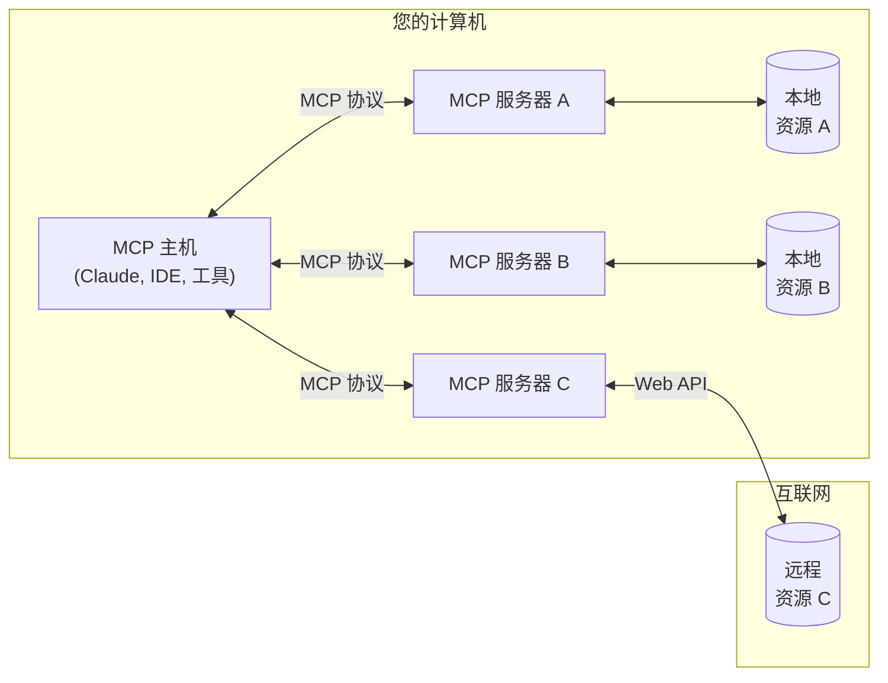
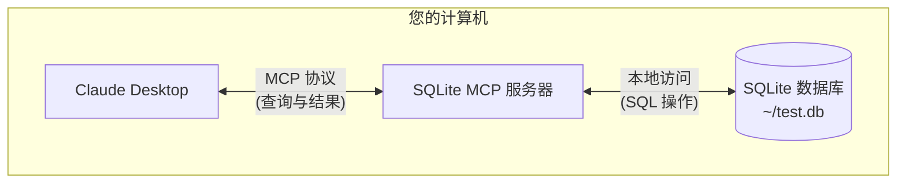

MCP 是一种协议，可以在主机应用程序（如 [Claude Desktop](https://claude.ai/download)）与本地服务之间建立安全连接。在本快速入门指南中，您将学习如何：

- 设置本地 SQLite 数据库
- 通过 MCP 将 Claude Desktop 连接到数据库
- 安全地查询和分析数据

<Note>
虽然本指南以 Claude Desktop 作为 MCP 主机示例，但该协议是开放的，可以由任何应用集成。IDE、AI 工具和其他软件都可以用标准化的方式通过 MCP 连接到本地集成。
</Note>

<Warning>
Claude Desktop 的 MCP 支持目前处于开发者预览阶段，仅支持连接到您计算机上运行的本地 MCP 服务器。目前不支持远程 MCP 连接。此集成仅在 Claude Desktop 应用中可用，不支持 Claude 网页界面 (claude.ai)。
</Warning>

## MCP 工作原理

MCP（模型上下文协议）是一个开放协议，可以在 AI 应用程序与本地或远程资源之间实现安全、可控的交互。让我们先了解它的工作原理，然后再看看如何在本指南中使用它。

### 总体架构
MCP 的核心是一个客户端-服务器架构，其中一个主机应用可以连接到多个服务器：



- **MCP 主机**：想要通过 MCP 访问资源的程序，如 Claude Desktop、IDE 或 AI 工具
- **MCP 客户端**：与服务器保持一对一连接的协议客户端
- **MCP 服务器**：通过标准化的模型上下文协议提供特定功能的轻量级程序
- **本地资源**：MCP 服务器可以安全访问的计算机资源（数据库、文件、服务）
- **远程资源**：MCP 服务器可以通过互联网连接的资源（如通过 API）

### 本指南内容

在本快速入门中，我们将使用 SQLite 实现一个重点示例：



1. Claude Desktop 作为 MCP 客户端
2. SQLite MCP 服务器提供安全的数据库访问
3. 本地 SQLite 数据库存储实际数据

SQLite MCP 服务器与本地 SQLite 数据库之间的通信完全在您的计算机上进行&mdash;您的 SQLite 数据库不会暴露在互联网上。模型上下文协议确保 Claude Desktop 只能通过定义好的接口执行被授权的数据库操作。这为您提供了一种安全的方式，让 Claude 在您完全控制其访问权限的同时分析和交互您的本地数据。

## 前提条件

- macOS 或 Windows
- 已安装最新版本的 [Claude Desktop](https://claude.ai/download)
- [uv](https://docs.astral.sh/uv/) 0.4.18 或更高版本（运行 `uv --version` 检查）
- Git（运行 `git --version` 检查）
- SQLite（运行 `sqlite3 --version` 检查）

<AccordionGroup>
  <Accordion title="安装前提条件（macOS）">
  ```bash
  # 使用 Homebrew
  brew install uv git sqlite3

  # 或直接下载：
  # uv：https://docs.astral.sh/uv/
  # Git：https://git-scm.com
  # SQLite：https://www.sqlite.org/download.html
  ```
  </Accordion>
  <Accordion title="安装前提条件（Windows）">
  ```powershell
  # 使用 winget
  winget install --id=astral-sh.uv -e
  winget install git.git sqlite.sqlite

  # 或直接下载：
  # uv：https://docs.astral.sh/uv/
  # Git：https://git-scm.com
  # SQLite：https://www.sqlite.org/download.html
  ```
  </Accordion>
</AccordionGroup>

## 安装

<Tabs>
  <Tab title="macOS">
    <Steps>
      <Step title="创建示例数据库">
        让我们创建一个简单的 SQLite 数据库用于测试：

        ```bash
        # 创建新的 SQLite 数据库
        sqlite3 ~/test.db <<EOF
        CREATE TABLE products (
          id INTEGER PRIMARY KEY,
          name TEXT,
          price REAL
        );

        INSERT INTO products (name, price) VALUES
          ('Widget', 19.99),
          ('Gadget', 29.99),
          ('Gizmo', 39.99),
          ('Smart Watch', 199.99),
          ('Wireless Earbuds', 89.99),
          ('Portable Charger', 24.99),
          ('Bluetooth Speaker', 79.99),
          ('Phone Stand', 15.99),
          ('Laptop Sleeve', 34.99),
          ('Mini Drone', 299.99),
          ('LED Desk Lamp', 45.99),
          ('Keyboard', 129.99),
          ('Mouse Pad', 12.99),
          ('USB Hub', 49.99),
          ('Webcam', 69.99),
          ('Screen Protector', 9.99),
          ('Travel Adapter', 27.99),
          ('Gaming Headset', 159.99),
          ('Fitness Tracker', 119.99),
          ('Portable SSD', 179.99);
        EOF
        ```
      </Step>

      <Step title="配置 Claude Desktop">
        在文本编辑器中打开 Claude Desktop 应用配置文件 `~/Library/Application Support/Claude/claude_desktop_config.json`。

        例如，如果您安装了 [VS Code](https://code.visualstudio.com/)：

        ```bash
        code ~/Library/Application\ Support/Claude/claude_desktop_config.json
        ```

        添加此配置（将 YOUR_USERNAME 替换为您的实际用户名）：

        ```json
        {
          "mcpServers": {
            "sqlite": {
              "command": "uvx",
              "args": ["mcp-server-sqlite", "--db-path", "/Users/YOUR_USERNAME/test.db"]
            }
          }
        }
        ```

        这告诉 Claude Desktop：
        1. 有一个名为"sqlite"的 MCP 服务器
        2. 通过运行 `uvx mcp-server-sqlite` 启动它
        3. 将其连接到您的测试数据库

        保存文件，然后重启 **Claude Desktop**。
      </Step>
    </Steps>
  </Tab>
  <Tab title="Windows">
    <Steps>
      <Step title="创建示例数据库">
        让我们创建一个简单的 SQLite 数据库用于测试：

        ```powershell
        # 创建新的 SQLite 数据库
        $sql = @'
        CREATE TABLE products (
          id INTEGER PRIMARY KEY,
          name TEXT,
          price REAL
        );

        INSERT INTO products (name, price) VALUES
          ('Widget', 19.99),
          ('Gadget', 29.99),
          ('Gizmo', 39.99),
          ('Smart Watch', 199.99),
          ('Wireless Earbuds', 89.99),
          ('Portable Charger', 24.99),
          ('Bluetooth Speaker', 79.99),
          ('Phone Stand', 15.99),
          ('Laptop Sleeve', 34.99),
          ('Mini Drone', 299.99),
          ('LED Desk Lamp', 45.99),
          ('Keyboard', 129.99),
          ('Mouse Pad', 12.99),
          ('USB Hub', 49.99),
          ('Webcam', 69.99),
          ('Screen Protector', 9.99),
          ('Travel Adapter', 27.99),
          ('Gaming Headset', 159.99),
          ('Fitness Tracker', 119.99),
          ('Portable SSD', 179.99);
        '@

        cd ~
        & sqlite3 test.db $sql
        ```
      </Step>

      <Step title="配置 Claude Desktop">
        在文本编辑器中打开 Claude Desktop 应用配置文件 `%APPDATA%\Claude\claude_desktop_config.json`。

        例如，如果您安装了 [VS Code](https://code.visualstudio.com/)：

        ```powershell
        code $env:AppData\Claude\claude_desktop_config.json
        ```

        添加此配置（将 YOUR_USERNAME 替换为您的实际用户名）：

        ```json
        {
          "mcpServers": {
            "sqlite": {
              "command": "uvx",
              "args": [
                "mcp-server-sqlite",
                "--db-path",
                "C:\\Users\\YOUR_USERNAME\\test.db"
              ]
            }
          }
        }
        ```

        这告诉 Claude Desktop：
        1. 有一个名为"sqlite"的 MCP 服务器
        2. 通过运行 `uvx mcp-server-sqlite` 启动它
        3. 将其连接到您的测试数据库

        保存文件，然后重启 **Claude Desktop**。
      </Step>
    </Steps>
  </Tab>
</Tabs>

## 测试一下

让我们验证一切是否正常工作。尝试向 Claude Desktop 发送这个提示：

```
您能连接到我的 SQLite 数据库并告诉我有哪些产品和它们的价格吗？
```

Claude Desktop 将：
1. 连接到 SQLite MCP 服务器
2. 查询您的本地数据库
3. 格式化并呈现结果

<Frame caption="Claude Desktop 成功查询我们的 SQLite 数据库 🎉">
  
</Frame>

## 底层发生了什么？

当您通过 MCP 与 Claude Desktop 交互时：

1. **服务器发现**：Claude Desktop 在启动时连接到您配置的 MCP 服务器
2. **协议握手**：当您询问数据时，Claude Desktop：
   - 识别哪个 MCP 服务器可以提供帮助（本例中为 sqlite）
   - 通过协议协商功能
   - 向 MCP 服务器请求数据或操作

3. **交互流程**：
   ```mermaid
   sequenceDiagram
       participant C as Claude Desktop
       participant M as MCP 服务器
       participant D as SQLite 数据库

       C->>M: 初始化连接
       M-->>C: 可用功能

       C->>M: 查询请求
       M->>D: SQL 查询
       D-->>M: 结果
       M-->>C: 格式化结果
   ```

4. **安全性**：
   - MCP 服务器只暴露特定、可控的功能
   - MCP 服务器在您的计算机上本地运行，其访问的资源不会暴露在互联网上
   - Claude Desktop 需要用户确认敏感操作

## 尝试这些示例

现在 MCP 已经工作，试试这些逐渐复杂的示例：

<AccordionGroup>
  <Accordion title="基本查询" active>
    ```
    数据库中所有产品的平均价格是多少？
    ```
  </Accordion>
  <Accordion title="数据分析">
    ```
    您能分析价格分布并建议一些定价优化吗？
    ```
  </Accordion>
  <Accordion title="复杂操作">
    ```
    您能帮我设计并创建一个用于存储客户订单的新表吗？
    ```
  </Accordion>
</AccordionGroup>

## 添加更多功能

想给 Claude Desktop 更多本地集成功能？将这些服务器添加到您的配置中：

<Note>
  注意这些 MCP 服务器需要在您的计算机上安装 [Node.js](https://nodejs.org/zh-cn)。
</Note>

<AccordionGroup>
  <Accordion title="文件系统访问" icon="folder-open">
    添加此配置以让 Claude Desktop 读取和分析文件：
    ```json
    "filesystem": {
      "command": "npx",
      "args": ["-y", "@modelcontextprotocol/server-filesystem", "/Users/YOUR_USERNAME/Desktop"]
    }
    ```
  </Accordion>

  <Accordion title="PostgreSQL 连接" icon="database">
    将 Claude Desktop 连接到您的 PostgreSQL 数据库：
    ```json
    "postgres": {
      "command": "npx",
      "args": ["-y", "@modelcontextprotocol/server-postgres", "postgresql://localhost/mydb"]
    }
    ```
  </Accordion>
</AccordionGroup>

## 更多 MCP 客户端

虽然本指南以 Claude Desktop 作为客户端演示 MCP，但还有其他几个应用程序支持 MCP 集成：

<CardGroup cols={2}>
  <Card
    title="Zed 编辑器"
    icon="pen-to-square"
    href="https://zed.dev">
    内置 MCP 支持的高性能多人代码编辑器，提供 AI 驱动的编码辅助
  </Card>

  <Card
    title="Cody"
    icon="magnifying-glass"
    href="https://sourcegraph.com/cody">
    具有 MCP 集成的代码智能平台，提供增强的代码搜索和分析功能
  </Card>
</CardGroup>

每个主机应用可能以不同方式实现 MCP 功能或支持不同的功能。请查看它们各自的文档了解具体设置说明和支持的功能。

## 故障排除

<AccordionGroup>
  <Accordion title="Claude Desktop 中没有显示任何内容？">
    1. 检查是否启用了 MCP：
       - 点击 Claude Desktop 聊天框旁边的 🔌 图标
       - 展开"已安装的 MCP 服务器"
       - 您应该能看到配置的服务器

    2. 验证您的配置：
       - 从 Claude Desktop 中，转到 Claude > 设置...
       - 打开"开发者"选项卡查看您的配置

    3. 完全重启 Claude Desktop：
       - 退出应用（不只是关闭窗口）
       - 重新启动
  </Accordion>

  <Accordion title="MCP 或数据库错误？">
    1. 检查 Claude Desktop 的日志：
       ```bash
       tail -n 20 -f ~/Library/Logs/Claude/mcp*.log
       ```

    2. 验证数据库访问：
       ```bash
       # 测试数据库连接
       sqlite3 ~/test.db ".tables"
       ```

    3. 常见修复：
       - 检查配置中的文件路径
       - 验证数据库文件权限
       - 确保正确安装了 SQLite
  </Accordion>
</AccordionGroup>

## 下一步

<CardGroup cols={2}>
  <Card title="构建您的第一个 MCP 服务器" icon="code" href="/docs/first-server/python">
    创建您自己的 MCP 服务器，为 LLM 客户端提供新功能。
  </Card>

  <Card title="探索示例" icon="github" href="https://github.com/modelcontextprotocol/servers">
    浏览我们的示例服务器集合，了解可以实现什么。
  </Card>
</CardGroup>